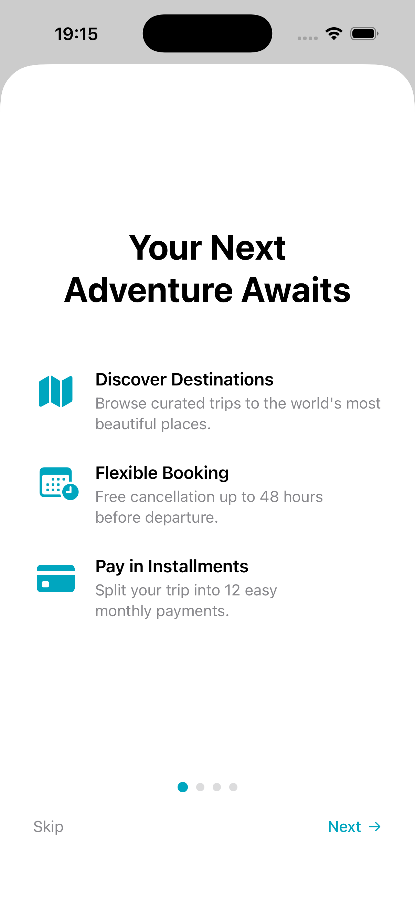
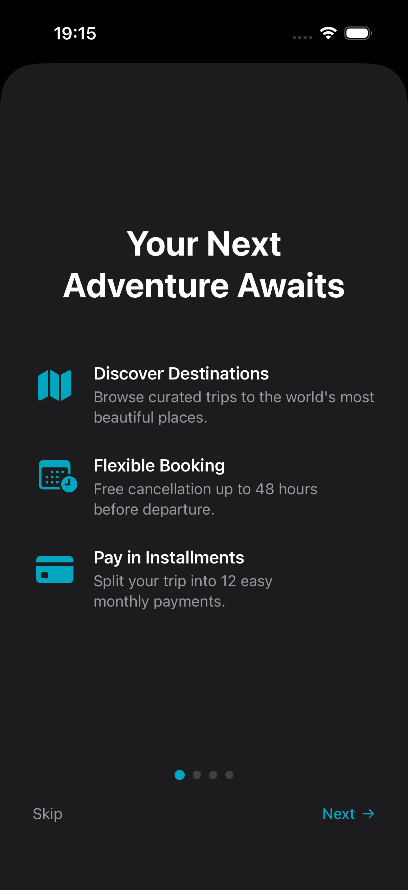
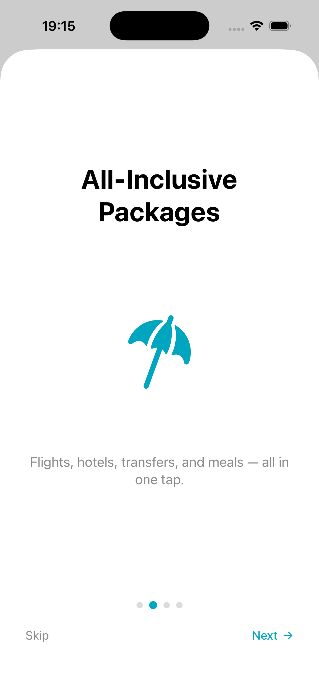
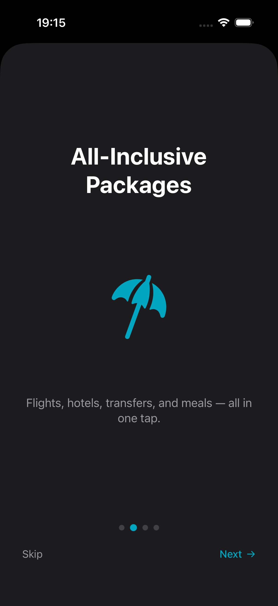
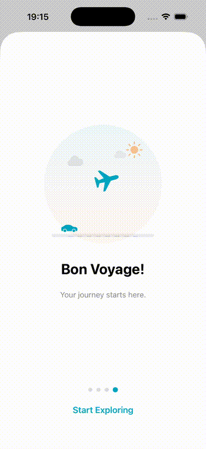
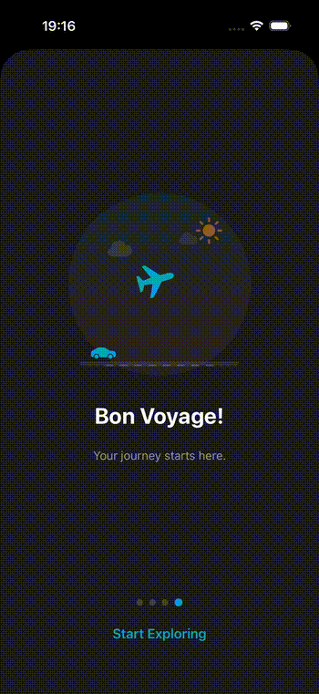

# iOS ShowcaseKit

A lightweight, customizable onboarding and feature showcase library for SwiftUI.

Built with modern Swift — no dependencies, no UIKit, just SwiftUI.

## Screenshots

### `.feature` Row

<p align="center">
  &nbsp;&nbsp;&nbsp;&nbsp;&nbsp;&nbsp;
</p>

### `.hero` + `.text` Row

<p align="center">
  &nbsp;&nbsp;&nbsp;&nbsp;&nbsp;&nbsp;
</p>

### `.custom` Row (Animated)

<p align="center">
  &nbsp;&nbsp;&nbsp;&nbsp;&nbsp;&nbsp;
</p>

## Features

- Swipe-based page navigation with dot indicator
- Built-in row types: feature, hero, text
- Fully custom rows with any SwiftUI view
- Theming via `ShowcaseConfig` (colors, text, background)
- Skip / Next / Get Started navigation
- `onDismiss` callback with skip vs. complete distinction
- Accessibility support (VoiceOver labels and hints)
- RTL language support
- Dark mode support
- iOS 17+ / Swift 6

## Installation

Add ShowcaseKit to your project via Swift Package Manager:

```
https://github.com/tahakirca/ShowcaseKit.git
```

Or in `Package.swift`:

```swift
dependencies: [
    .package(url: "https://github.com/tahakirca/ShowcaseKit.git", from: "1.0.0")
]
```

## Quick Start

```swift
import ShowcaseKit

struct ContentView: View {
    @State private var showOnboarding = true

    var body: some View {
        Text("My App")
            .showcaseSheet(isPresented: $showOnboarding, pages: [
                ShowcasePage(
                    title: "Welcome",
                    rows: [
                        ShowcaseRow(type: .feature(
                            image: .system("bell.fill"),
                            title: "Notifications",
                            description: "Stay updated in real time."
                        )),
                        ShowcaseRow(type: .feature(
                            image: .system("lock.fill"),
                            title: "Secure",
                            description: "Your data is always encrypted."
                        )),
                    ]
                ),
                ShowcasePage(
                    title: "Ready?",
                    rows: [
                        ShowcaseRow(type: .text("You're all set to go.")),
                    ],
                    buttonTitle: "Get Started"
                ),
            ]) { reason in
                switch reason {
                case .skipped:
                    print("User skipped")
                case .completed:
                    print("User completed onboarding")
                }
            }
    }
}
```

## Row Types

### Feature

Icon + title + description. The standard onboarding row.

```swift
ShowcaseRow(type: .feature(
    image: .system("chart.bar.fill"),
    title: "Analytics",
    description: "Track everything in real time."
))
```

### Hero

Large centered image. Great for the top of a page.

```swift
ShowcaseRow(type: .hero(image: .system("globe.americas.fill")))
```

### Text

Centered body text.

```swift
ShowcaseRow(type: .text("Simple and powerful."))
```

### Custom

Any SwiftUI view. Full control.

```swift
ShowcaseRow(type: .custom {
    VStack(spacing: 12) {
        Image(systemName: "sparkles")
            .font(.system(size: 64))
            .foregroundStyle(.orange)
        Text("AI Powered")
            .font(.title2.bold())
        Text("Smart features built just for you.")
            .font(.subheadline)
            .foregroundStyle(.secondary)
    }
})
```

## Images

Use SF Symbols or asset catalog images:

```swift
.system("bell.fill")     // SF Symbol
.asset("my-image")       // Asset catalog
```

## Theming

Customize colors and navigation text with `ShowcaseConfig`:

```swift
.showcaseSheet(
    isPresented: $show,
    pages: pages,
    config: ShowcaseConfig(
        accentColor: .indigo,
        backgroundColor: .black,
        titleColor: .white,
        skipText: "Skip",
        nextText: "Next"
    )
)
```

### All Config Options

| Property | Default | Description |
|---|---|---|
| `accentColor` | `.blue` | Primary accent color |
| `backgroundColor` | System background | Sheet background |
| `titleColor` | Primary | Page title color |
| `buttonColor` | Accent | Get Started button color |
| `iconColor` | Accent | Feature row icon color |
| `dotActiveColor` | Accent | Active dot color |
| `dotInactiveColor` | Secondary 30% | Inactive dot color |
| `skipText` | "Skip" | Skip button text |
| `skipColor` | Secondary | Skip button color |
| `nextText` | "Next" | Next button text |
| `nextColor` | Accent | Next button color |
| `isSwipeDismissEnabled` | `false` | Allow swipe-to-dismiss |

## Dismiss Callback

Distinguish between skip and complete:

```swift
.showcaseSheet(isPresented: $show, pages: pages) { reason in
    switch reason {
    case .skipped:
        // User tapped Skip
        break
    case .completed:
        // User finished all pages
        break
    }
}
```

## Page Options

| Property | Default | Description |
|---|---|---|
| `title` | `nil` | Optional page title |
| `rows` | Required | Array of `ShowcaseRow` |
| `buttonTitle` | "Continue" | Last page button text |

## Navigation Behavior

- **Non-last pages**: Skip (left) + Next with arrow (right)
- **Last page**: Single centered button with `buttonTitle`
- Swipe between pages is always enabled
- Sheet dismiss is disabled by default (configurable via `isSwipeDismissEnabled`)

## Requirements

- iOS 17+
- Swift 6.0+
- Xcode 16+

## License

MIT
